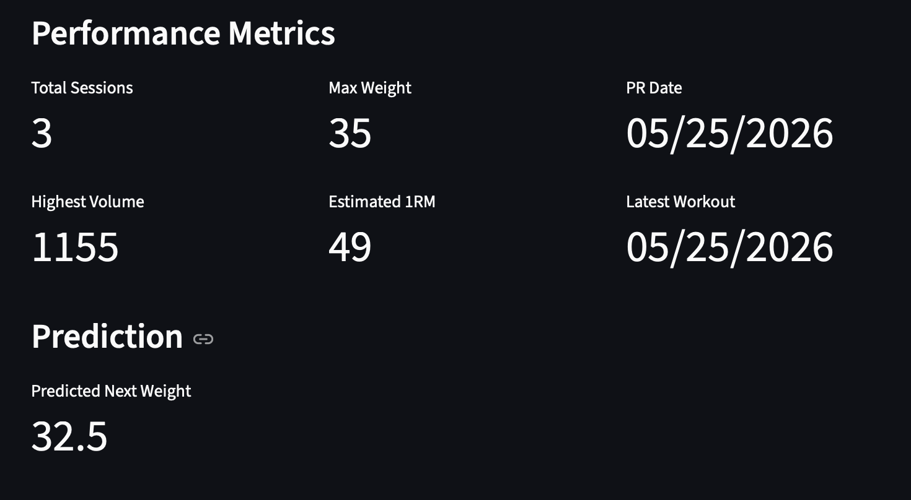
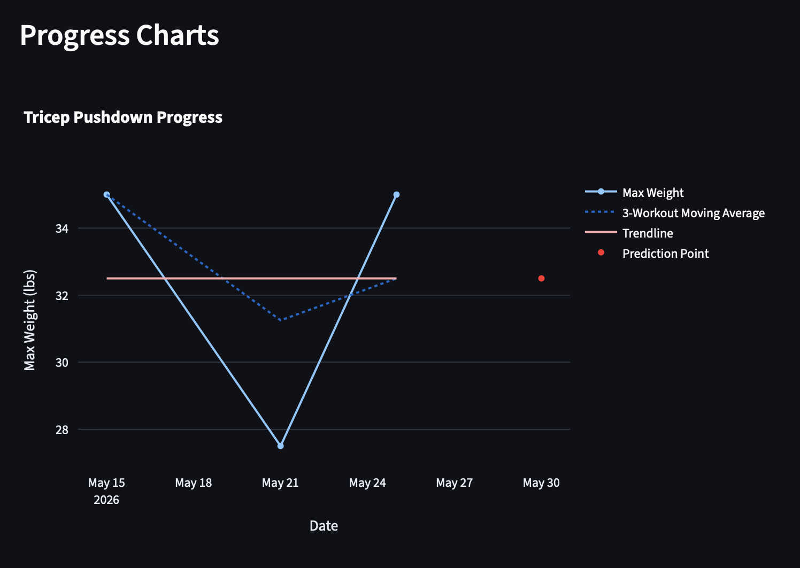

# Workout Analytics Dashboard

A Streamlit-based dashboard for logging workouts, analyzing exercise-specific progress, forecasting future performance, and generating AI-powered workout insights.

## Features

- Log multiple sets for an exercise in one submission
- Add optional workout notes for context around unusual sessions
- Filter analytics by exercise
- Calculate volume and estimated one-rep max dynamically
- Track total sessions, max weight, highest volume, PR date, estimated 1RM, and latest workout
- Visualize max weight, volume, and estimated 1RM progress with Plotly
- Display a 3-workout moving average on the max weight chart
- Forecast next workout max weight using manually implemented linear regression
- Display a trendline and future prediction point on the progress chart
- Generate AI workout insights using the Google Gemini API

## Forecasting

- The app uses simple least-squares linear regression to estimate the next max weight for a selected exercise.
- Workout sessions are converted into indices, and the model calculates the slope and intercept manually instead of using statistical modeling libraries. This was done to better understand how linear regression works.
- The prediction point is placed using the median gap between workout dates for the selected exercise instead of assuming a fixed interval.
- If there are fewer than two workouts for an exercise, the prediction will display `N/A`.

## Screenshots

### Performance Metrics


### Progress Charts


## Testing

The forecasting code is separated into `forecasting.py` and tested with `pytest`.

Run tests:

```bash
pytest
```

## Technologies

- Python
- Streamlit
- Pandas
- Plotly
- Google Gemini API
- Pytest

## Running Locally

Install dependencies:

```bash
pip install -r requirements.txt
```
Run the app:

```bash
streamlit run app.py
```